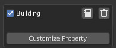
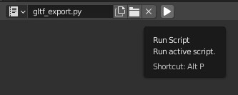

## Intro

[glTF](https://www.khronos.org/gltf/) is used as a format to load our scenes from. Essentially, now various things like main menu, networkable object templates, etc. etc. are set up using [Blender](https://www.blender.org/).

It is possible to model, add components, set transform types, and nest individual objects within blender, and use them as GameObjects within the game. Example building network template:

Here, this building is set up the same way it was in the code to have a TransformHex, and 2 components - NetworkHexTransform, and Building:

Currently, in-game shading is not representative of what the final rendering will be. Aim to make thing look right in Blender, because in the end it will look more like Blender's rendered view:

## Setup

To modify scenes, install the dragonskulle blender addon. Go to "Edit/Preferences":

Then click the "Add-ons" tab:

Click "Install...":

Navigate to assets directory of the git repo:

And double click the "dskulle\_addon.py". It will install it, and display the addon in the list:

Enable it!

## Usage

You should now see a new tab on the right of 3D view:

Clicking on it will show all Game Object properties available for the last selected object:

Different objects have different properties:

Transform controls whether the object will have Hex or 3D transform:

This will not change how the blender coordinates are interpreted - they are always 3D, but it changes what transform the objects will have in the game. Upon creating an object with Hex transform, conversion takes place to convert 3D coordinates to axial coordinates. Note that while positions are always converted fully, rotation and scale information gets truncated on TransformHex - only roll (Z axis) rotation is preserved, while the rest of the rotation, and scaling gets ignored.

Adding components is simple, just click "Add Component" button:

Then you can either pick a component from the list, or enter the class name manually:

Class list should contain all components, you can search the list by the component's name or package:

However, there is a chance that the component you need is not found in the list. In that case, enter the full class name, including the entire package path:

Once a component is added, you can control its enabled state, change its class, delete it altogether, and add a customized property (variable):

The first three are trivial, meanwhile adding a customized property is similar to adding a component. You can either add from a parsed property list, or choose a manual name and type:

Here we have an even higher probability of missing properties. In an event where a property is missing, enter it manually:

Choose a matching type, currently only numbers, booleans, vectors and strings are supported. On java side, the variable either has to be a direct type (primitive, String, Vector3f), or a Sync type (SyncInt, SyncFloat, SyncVector3, etc.):

Enter its name:

And click "OK":

You can then set the value of the property, script it with a driver, or anything else blender allows:

## Exporting:

All blender scenes should be placed in assets subdirectory.

Main menu scene is inside `main_menu.blend`. Networkable templates are inside `network_templates.blend`. Shared templates are meant to be put inside `templates.blend`, and linked into other blender files (take a look at `main_menu_hexagon` inside templates and main\_menu).

Exporting on Linux can be done with the `blend2gltf.sh` script.

If running the script is not possible, open up the "Scripting" tab:

Click "Open":

Navigate to the "assets" subdirectory and open "gltf\_export.py" file:

Run the script:

